# CEFET-ORGANIZER
Projeto desenvolvido pelos alunos Anielly, Eduardo G , Eduardo R , Mateus e Rafael na disciplina de Modelagem e Desenvolvimento de Software no 5° perído de Engenharia da Computação no CEFET-MG.

## Passo a Passo da Utilização do Software
O sistema foi desenvolvido na paltaforma do Visual Studio Code (VSCode). Nela foram baixadas 3 extensões : HTML CSS Support, JavaScript (ES6) code snippets e Live Server. Essas são essenciais para o funcionamento do CEFET-ORGANIZER. 

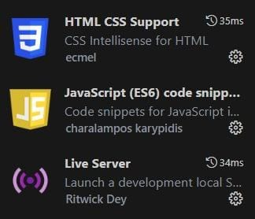

Para obter a visualização na web após a instalação do VSCode, das extensões e de possuir o código disponibilizado no computador, a pessoa deverá ir no arquivo "index.html" no Visual Studio e clicar no "Go Live" no canto inferior direito. Ele direcionará para uma página Web.

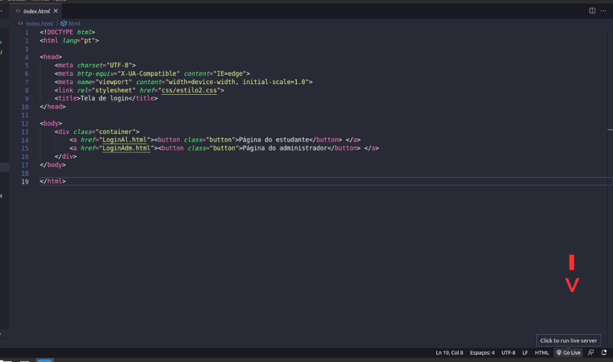

A seguinte página abrirá:

O primeiro ato deverá ser clicar na página do administrador para cadastrar o curso e utilizar os outros métodos.

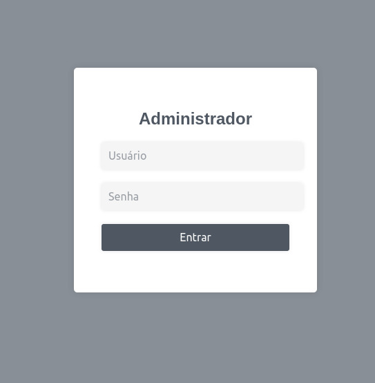

Por enquanto não há funcionalidade de login, mas só será possível passar para a próxima página preenchendo os campos mostrados na imagem acima. Por isso, iremos usar usuário: adm e senha: 1234, mas poderá ser qualquer um até adicionarmos a funcionalidade.

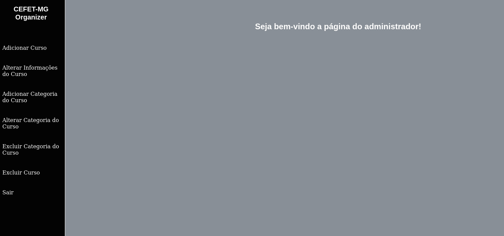

Nessa página inicial primeiro iremos no adicionar curso e cadastraremos 3 cursos (Engenharia da Computação, Engenharia Mecatrônica, Design de Moda) visto que iremos excluir um para mostrar a funcionalidade e porque também nossa caixa de seleção ainda não consegue selecionar apenas um item tendo só um item (estamos trabalhando para que isso seja resolvido). Além que se você quiser selecionar o primeiro item, deverá selecionar o segundo e depois o primeiro em todas as seções para que ele funcione corretamente, se não dará erro.

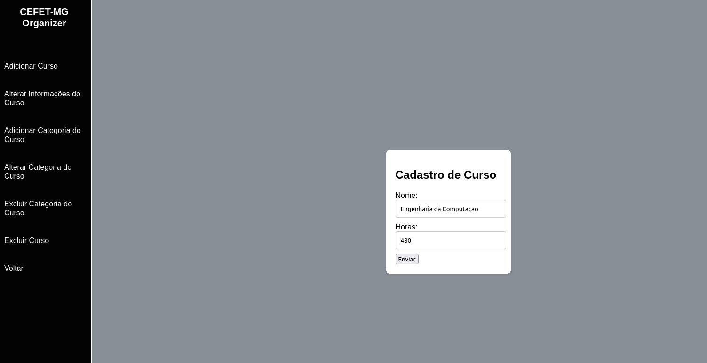

Agora iremos alterar as horas totais do curso Engenharia da Computação.

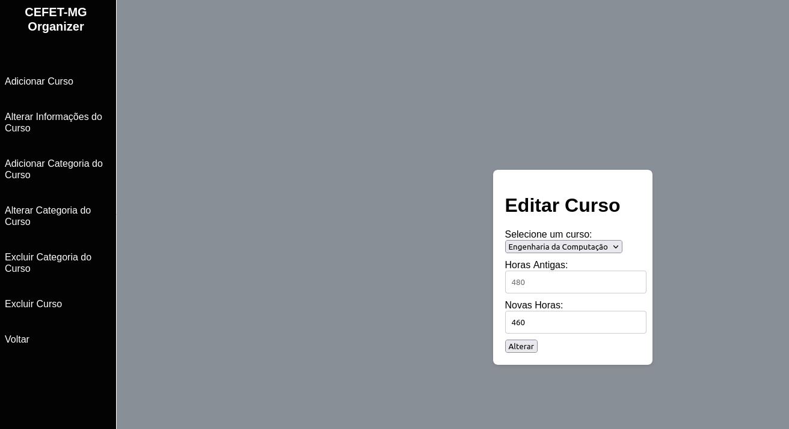

Finalmente, iremos excluir um curso.

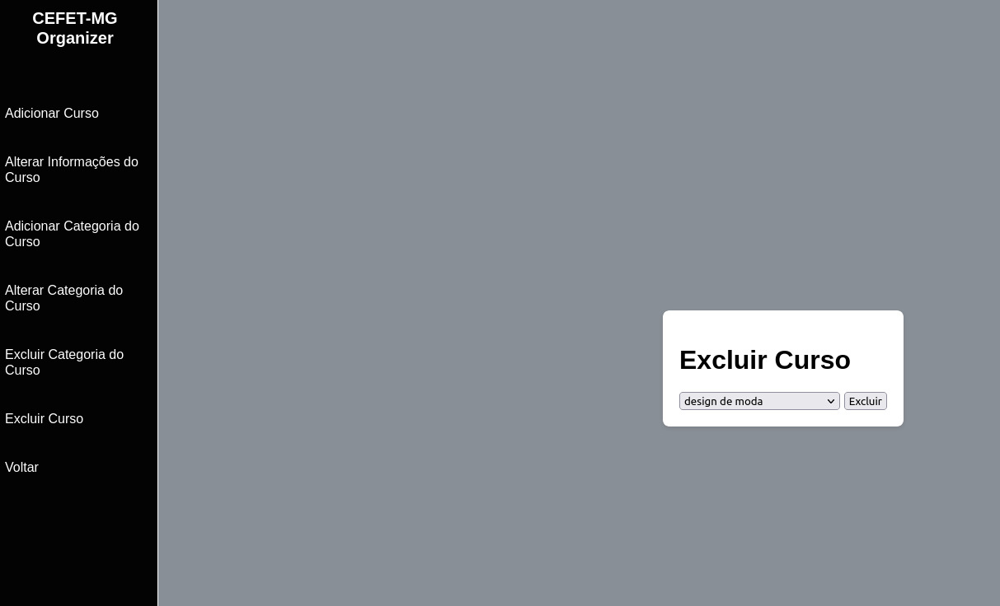

Agora, iremos adicionar três categorias ao curso Engenharia da Computação (palestras, estágio , cursos) visto que tem o problema na caixa de seleção e também porque teremos que excluir uma categoria.

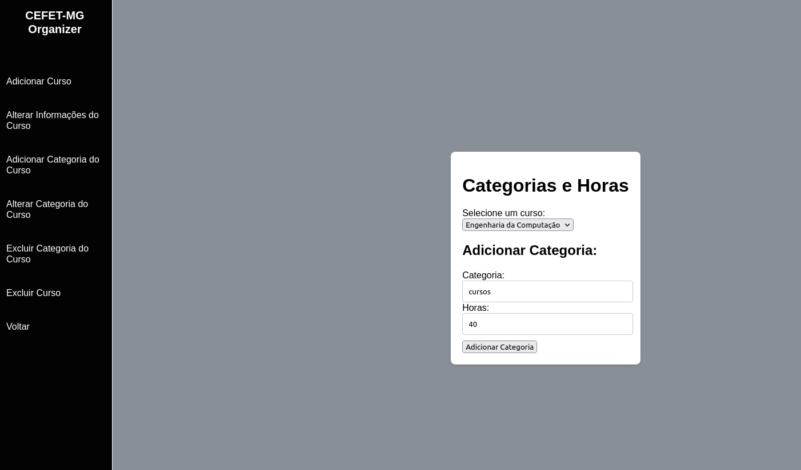

Agora alteraremos uma categoria e depois excluiremos uma categoria.

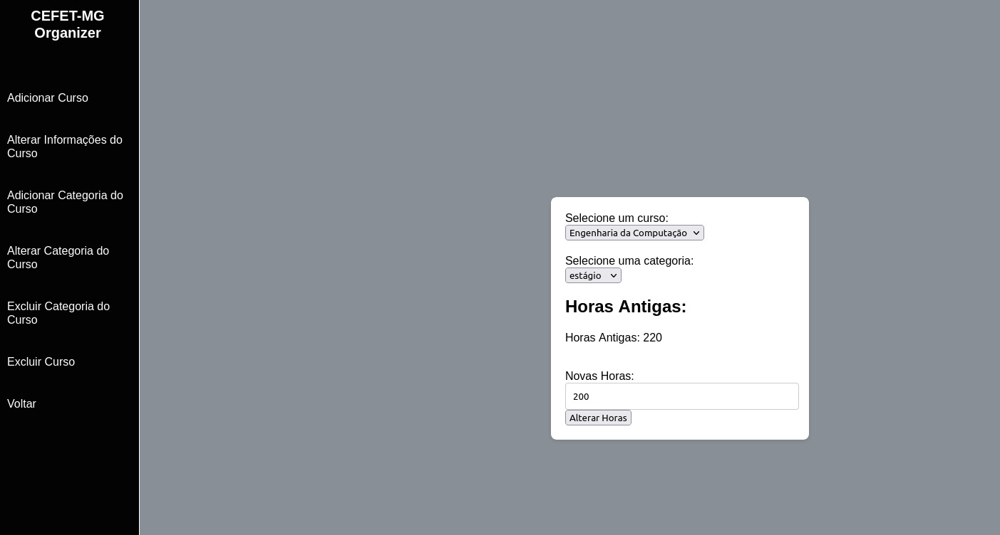

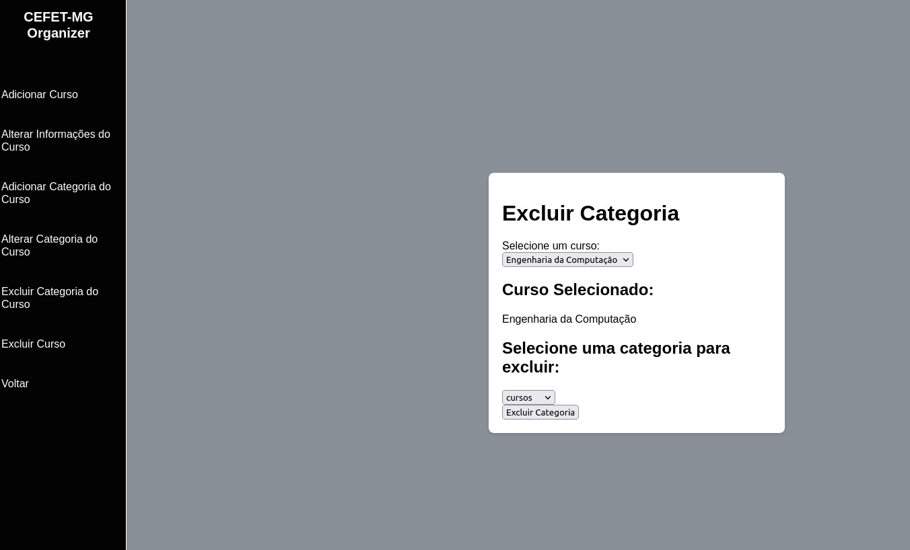

Agora clicaremos no voltar para irmos a página principal do administrador e depois iremos no sair. Assim, voltando para a página inicial (index.html) e agora utilizaremos o software como alunos.

Igual ao administrador , ainda não há a funcionalidade de login. Por isso, usaremos usuário:aluno e senha:1234, mas qualquer usuário e senha funcionam por enquanto.

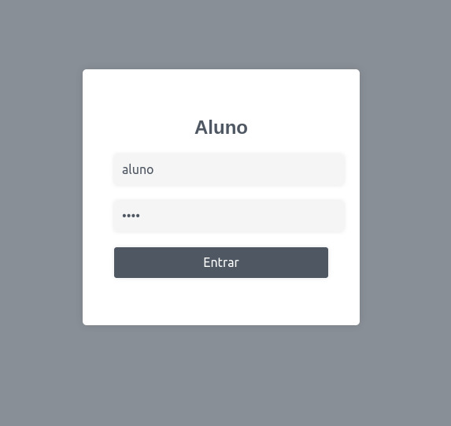

Agora como alunos temos menos métodos e o primeiro a utilizarmos será o adicionar hora complementar feita.

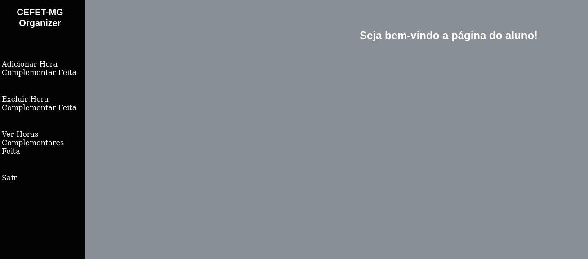

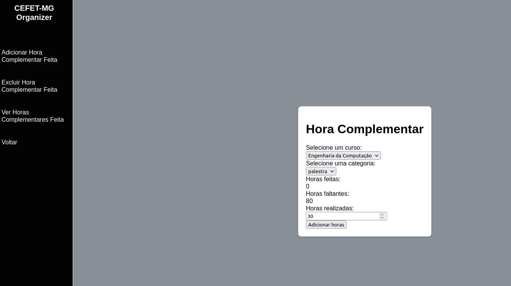

Agora iremos excluir algumas horas complementares feitas.

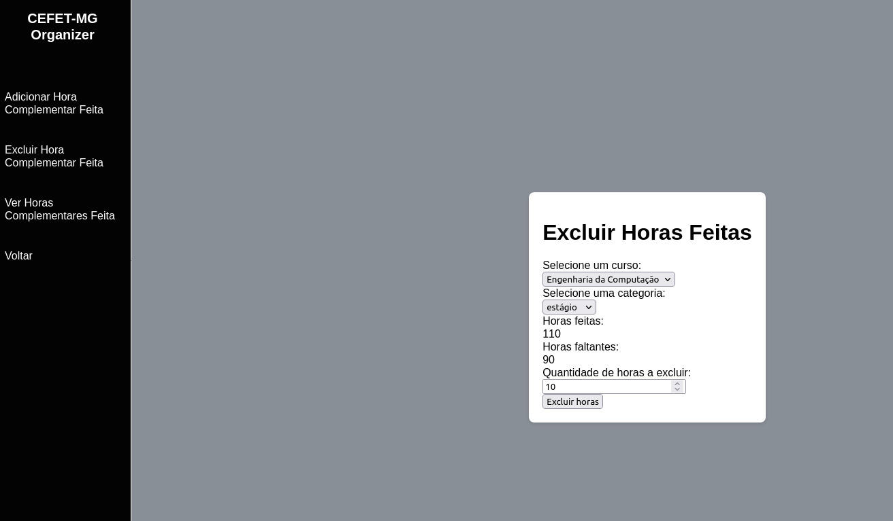

E por fim iremos visualizar o gráfico das horas feitas e das restantes em relação as horas complementares totais do curso.

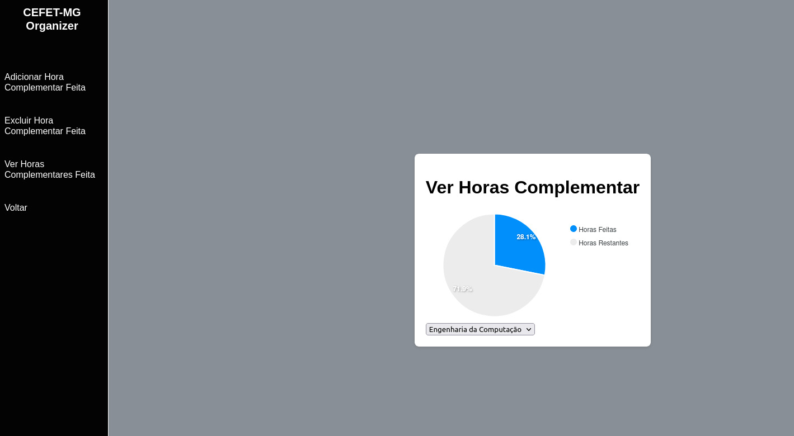